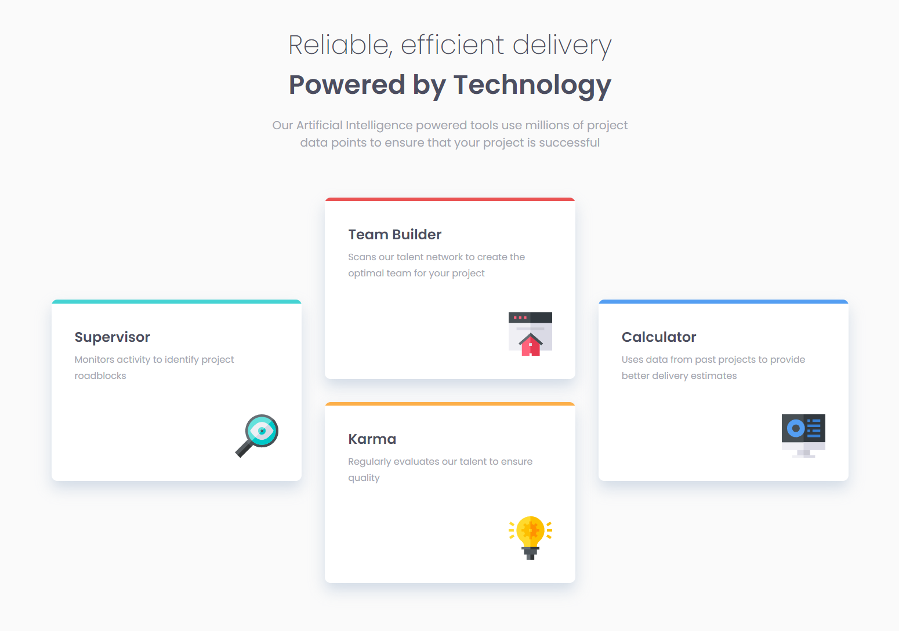

# Frontend Mentor - Four card feature section solution

This is a solution to the [Four card feature section challenge on Frontend Mentor](https://www.frontendmentor.io/challenges/four-card-feature-section-weK1eFYK). Frontend Mentor challenges help you improve your coding skills by building realistic projects. 

### About

Eighth exercice from Frontend Mentor website. The purpose is to train HTML, SCSS.

**HTML, SCSS**

[Preview-site](https://florianjourde.github.io/Frontend-Mentor-8-Four-card-feature-section)